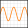
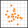
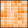
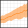
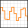
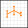
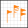
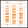
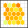
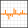

# Data visualization cheatsheet

In this cheatsheet we will be focusing on creating beautiful charts with libraries like matplotlib, seaborn and plotly.

**Matplotlib** is the most commonly used plotting library with a lot of flexibility, but it lacks a visually appealing 
design and has no interactivity.

**Seaborn** is build on top of Matplotlib, enhances the style of plots  and simplifies the plot creation a bit, but 
with that it lacks some configuration capabilities Matplotlib has.

**Plotly** is a visually beautiful interactive plotting library which also can run directly in your jupiter notebook.
While it is harder to create plots with it, these plots are production ready and can instantly turned into interactive 
plots online.

**To summarize**, you should use Matplotlib if you need extra flexibility and Plotly if you need good looking 
interactive plots. For everything else Seaborn is the way to go.

## Matplotlib
In matplotlib every plot is in a container or grid, these are called **figures**. Plots in figures are stored in **axis**,
these can be customized, changed in size and in location in the figure. **Ticks** are the steps on the x-axis/ y-axis, the
x-axis/y-axis is called **spine**, to differeciate better.

This library follows a simple workflow:
 1. create the Figure (only need if you show multiple plots, or you need more flexability)
    ```
    fig, ax = plt.subplots()
    ```

 2. create a specific type of plot with valuces for the x and y:
    ```
    ax.scatter(x=x_values, y=y_values)
    ```
 3. Change the styling (Here, scale of x-axis was changed):
    ```
    ax.xscale('log')
    ```
 4. Print the plot:
    ```
    fig.show()
    ```
 5. Clear plot for next grafic:
    ```
    # clear axis
    fig.cla()
    # clear figure
    fig.clf()
    ``` 
    
#### Short version of plotting
```
df.plot(kind="scatter", x=x_values, y=y_values)
plt.show()
```

    
### Different plots and elements in matplotlib

| Chart | Example | Parameters (bold is necessary) | Description |
|-------|---------|------------|-------------|
| plot([X],Y,[fmt],...)         |              | X,**Y**,fmt,color,marker,linestyle        | Used for change over time
| scatter(X,Y,...)              |     | **X**,**Y**,[s]izes,[c]olors,markers,cmap | Best to compare two features
| bar\[h](x,height,...)         |                 | **x**,**height**,width,bottom,align,color | barh rotates the plot
| imshow(Z,[cmap],...)          |        | **Z**,cmap,interpolation,extent,origin    | Displayes images
| contour\[f]([X],[Y],Z„...)    |     | X,Y,**Z**,levels,colors,extent,origin     | Visualizes values in an 2d array
| quiver([X],[Y],U,V,...)       |        | X,Y,**U**,**V**,C,units,angles            | Adds arrows
| pie(X,[explode],...)          |                 | **Z**,explode,labels,colors,radius        | Creates a piechart
| text(x,y,text,...)            |              | **x**,**y**,**text**,va,ha,size,weight,transform | addes text to plot at specific coordiantes
| fill\[_between]\[x]( ... )    |               | **X**,Y1,Y2,color,where                   | fills area between values
| step(X,Y,[fmt],...)           |           | **X**,**Y**,fmt,color,marker,where        | Different format of plot() with no transition
| boxplot(X,...)                |  | **X**,notch,sym,bootstrap,widths          | Boxplot shows outliars better
| errorbar(X,Y,xerr,yerr,...)   |  | **X**,**Y**,xerr,yerr,fmt              | Adds errorbars to plot(), to show how accurate values are
| hist(X, bins, ...)            |           | **X**,bins,range,density,weights          | Used to see value distribution
| violinplot(D,...)             |       | **X**,**Y**,fmt,color,marker,where        | An alternative to Boxplot
| barbs([X],[Y], U, V, ...)     |        | X,Y,**U**,**V**,C,length,pivot,sizes      | It's used to plot any two dimensional vector quantity
| eventplot(positions,...)      |    | **positions**,orientation,lineoffsets     | It's useful where you need to show timing or position of multiple sets of descrete events.
| hexbin(X,Y,C,...)             |     | **X**,**Y**,C,gridsize,bins               | Like a scatter plot, but hexagonals are buckets for values 
| xcorr(X,Y,...)                |        | **X**,**Y**,normed,detrend                | Plots the cross correlation between x and y.

### Most important customizations
* Gridlayout as figure
```
G = gridspec(cols,rows,...)
ax = G[0,:]
```

If you have subplots, then use the functions on the axis object
* Add title
    ```
    plt.title('Title')
    ```
* Add label for each axis
    ```
    plt.xlabel('x')
    ```
* Scale axis differently
    ```
    # You can choose between: "linear", "log", "symlog", "logit", ...
    plt.xscale('log')
    ```
* Set Axis vaules to specific values:
    ```
    # Here the first array is used to plot the data and the second is displayed to the viewer
    plt.xticks([0,2,4,6,8],
                ['0', '2B', '4B', '6B', '8B'])
    ```
* Add grid to the plot:
    ```
    plt.grid(True)
    ```
* Add text in the graph:
    ```
    plt.text(x-coor, y-coor, 'text')
    ```


## Seaborn


Different Seaborn polts:

### Distplot

### Regplot

### Lmplot


## Plotly
### UNDER CONSTRUCTION

# References
* https://matplotlib.org
* https://github.com/matplotlib/cheatsheets
* https://www.kaggle.com/residentmario/plotting-with-seaborn
* https://www.kaggle.com/kanncaa1/seaborn-tutorial-for-beginners