# Data visualization cheatsheet

In this cheatsheet we will be focusing on creating beautiful charts with libraries like matplotlib, seaborn and plotly.

**Matplotlib** is the most commonly used plotting library with a lot of flexibility, but it lacks a visually appealing 
design and has no interactivity.

**Seaborn** is build on top of Matplotlib, enhances the style of plots  and simplifies the plot creation a bit, but 
with that it lacks some configuration capabilities Matplotlib has.

**Plotly** is a visually beautiful interactive plotting library which also can run directly in your jupiter notebook.
While it is harder to create plots with it, these plots are production ready and can instantly turned into interactive 
plots online.

**To summarize**, you should use Matplotlib if you need extra flexibility and Plotly if you need good looking 
interactive plots. For everything else Seaborn is the way to go.

## Matplotlib
In matplotlib every plot is in a container or grid, these are called **figures**. Plots in figures are stored in **axis**,
these can be customized, changed in size and in location in the figure. **Ticks** are the steps on the x-axis/ y-axis, the
x-axis/y-axis is called **spine**, to differentiate better.

This library follows a simple workflow:
 1. create the Figure (only need if you show multiple plots, or you need more flexibility)
    ```
    fig, ax = plt.subplots()
    ```

 2. create a specific type of plot with values for the x and y:
    ```
    ax.scatter(x=x_values, y=y_values)
    ```
 3. Change the styling (Here, scale of x-axis was changed):
    ```
    ax.xscale('log')
    ```
 4. Print the plot:
    ```
    fig.show()
    ```
 5. Clear plot for next graphic:
    ```
    # clear axis
    fig.cla()
    # clear figure
    fig.clf()
    ``` 
    
#### Short version of plotting
```
df.plot(kind="scatter", x=x_values, y=y_values)
plt.show()
```

    
### Different plots and elements in matplotlib

| Chart | Example | Parameters (bold is necessary) | Description |
|-------|---------|------------|-------------|
| plot([X],Y,[fmt],...)         |  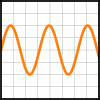            | X, **Y**, fmt, color, marker, linestyle        | Used for change over time
| scatter(X,Y,...)              | 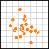    | **X**, **Y**, [s]izes, [c]olors, markers, cmap | Best to compare two features
| bar\[h](x,height,...)         |                 | **x**, **height**, width, bottom, align, color | barh rotates the plot
| imshow(Z,[cmap],...)          | 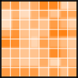       | **Z**, cmap, interpolation, extent, origin    | Displays images
| contour\[f]([X],[Y],Z„...)    | 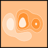    | X, Y, **Z**, levels, colors, extent, origin     | Visualizes values in an 2d array
| quiver([X],[Y],U,V,...)       | 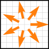       | X, Y, **U**, **V**, C, units, angles            | Adds arrows
| pie(X,[explode],...)          | 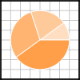                | **Z**, explode, labels, colors, radius        | Creates a piechart
| text(x,y,text,...)            |              | **x**, **y**, **text**, va, ha, size, weight, transform | adds text to plot at specific coordinates
| fill\[_between]\[x]( ... )    |               | **X**, Y1, Y2, color, where                   | fills area between values
| step(X,Y,[fmt],...)           | 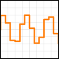          | **X**, **Y**, fmt, color, marker, where        | Different format of plot() with no transition
| boxplot(X,...)                | 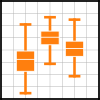 | **X**, notch, sym, bootstrap, widths          | Boxplot shows outliers better
| errorbar(X,Y,xerr,yerr,...)   | 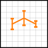 | **X**, **Y**, xerr, yerr, fmt              | Adds error bars to plot(), to show how accurate values are
| hist(X, bins, ...)            | 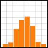          | **X**, bins, range, density, weights          | Used to see value distribution
| violinplot(D,...)             | 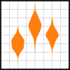      | **X**, **Y**, fmt, color, marker, where        | An alternative to Boxplot
| barbs([X],[Y], U, V, ...)     | 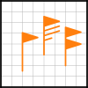       | X, Y, **U**, **V**, C, length, pivot, sizes      | It's used to plot any two dimensional vector quantity
| eventplot(positions,...)      | 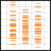   | **positions**, orientation, lineoffsets     | It's useful where you need to show timing or position of multiple sets of descrete events.
| hexbin(X,Y,C,...)             |     | **X**, **Y**, C, gridsize, bins               | Like a scatter plot, but hexagonals are buckets for values 
| xcorr(X,Y,...)                | 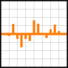       | **X**, **Y**, normed, detrend                | Plots the cross correlation between x and y.

### Most important customizations
* Grid layout as figure
```
G = gridspec(cols,rows,...)
ax = G[0,:]
```

If you have subplots, then use the functions on the axis object
* Add title
    ```
    plt.title('Title')
    ```
* Add label for each axis
    ```
    plt.xlabel('x')
    ```
* Scale axis differently
    ```
    # You can choose between: "linear", "log", "symlog", "logit", ...
    plt.xscale('log')
    ```
* Set Axis values to specific values:
    ```
    # Here the first array is used to plot the data and the second is displayed to the viewer
    plt.xticks([0,2,4,6,8],
                ['0', '2B', '4B', '6B', '8B'])
    ```
* Add grid to the plot:
    ```
    plt.grid(True)
    ```
* Add text in the graph:
    ```
    plt.text(x-coor, y-coor, 'text')
    ```


## Seaborn
Setting up a seaborn graph is quite simple in comparison to matplotlib:
````
import seaborn as sns

sns.distplot(df['column'], kde=False, bins=25)
````


### Different Seaborn plots:

#### Distribution Plots
| Chart | Example | Parameters | Description |
|-------|---------|------------|-------------|
| distplot([a],kde,bins) | 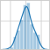  | **a**, kde, bins, hist, rug, fit, vertical, label |  Shows the distribution. (Will be deprecated, use displot(), histplot() instead)|
| jointplot(data, x,y) |   | **x**, **y**, data, kind, dropna  | Compares two distributions |
| kdeplot(data,[x], [y]) |  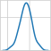 | **x**, y, data, fill, bw,  | A kernel density estimate (KDE) plot |
| pairplot(data) | 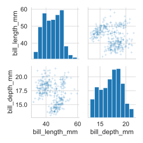  | **data**, vars, kind, diag_kind, | Plot pairwise relationships in a dataset |
| rugplot([a]) | 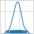  | **a**, data, x,y, legend | Plot marginal distributions by drawing ticks along the x and y axes |

#### Categorical Plots 
| Chart | Example | Parameters | Description |
|-------|---------|------------|-------------|
| barplot(x, y, data) |    | **data**, **x**, **y**, hue, estimator, order, orient, color, palette, saturation | Shows distribution of categorical data. Hue can hold additional categorical data|
| countplot(x, data) |   | **data**, **x**, y, order, orient, doge | Shows distribution though counting values |
| boxplot(x, y, data) |   | **data**, **x**, **y**, hue, fliersize | Displays a Boxplot |
| violinplot(x, y, data) | 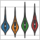  | **data**, **x**, **y**, hue, split, scale | Draw a combination of boxplot and kernel density estimate |
| stripplot(x, y, data) |   | **data**, **x**, **y**, hue, jitter, edgecolor, linewidth | Draw a scatterplot where one variable is categorical |
| swarmplot(x, y, data) |  | **data**, **x**, **y**, hue, color, size | Like a strip plot, without overlapping points |


#### Matrix Plots
Dataframes must be "pivoted", before it's useable in a heatmap:
```
df_mx = df.corr()

# create own correlation table with specific values
df = df.pivot_table(index='column1', columns='column2', values='column3')
```

| Chart | Example | Parameters | Description |
|-------|---------|------------|-------------|
| heatmap(data) | 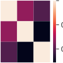 | **data** (2D dataset), vmin, vmax, cmap, center, robust, annot, cbar  | Plot rectangular data as a color-encoded matrix |
| clustermap(data) |  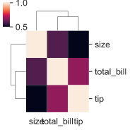 | **data**, pivot_kws, method, z_score standard_scale |  Plot a matrix dataset as a hierarchically-clustered heatmap |

#### Scatter Plots
* Pair Grid: Subplot grid for plotting pairwise relationships in a dataset
    ```
    g = sns.PairGrid(df)
    g.map(sns.scatterplot)
  
    # more customization
    df.map_offdiag(plt.scatter)
    df.map_diag(plt.hist)
  
    g.map_upper(sns.scatterplot)
    g.map_lower(sns.kdeplot)
    g.map_diag(sns.kdeplot)
    
    g.add_legend()
    ```

* Facet Grid: Multi-plot grid for plotting conditional relationships
    ```
    g = sns.FacetGrid(df, col="col1", row="col2", hue="col5")
    g.map(sns.scatterplot, "col3", "col4")
    ```
    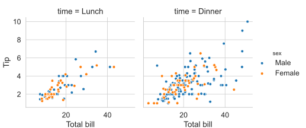
    
* Regression Plots: 
    ```
    sns.lmplot(x='col1', y='col2', data=df, col='col3', hue='col4',
              height=8, aspect=0.6)
  
    # important parameters: x, y, data, col, hue, row, markers, legend, x_estimator, x_bins, fit_reg, ...
    ```
    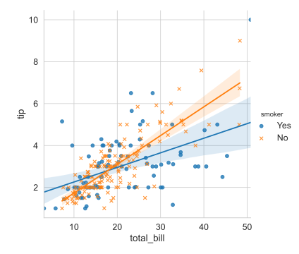
  
#### Styling
```
# different styles are: white, dartkgrid, whitegrid, dark,ticks
sns.set_style('white')

# Resize plot
plt.figure(figsize=(4,4))

# Change appearance of plot for different purposes: (paper, talk, poster)
sns.set_context('paper', font_scale=1.4)

# remove spines (Axis lines)
sns.despine(top=False, right=False)
```

## Plotly

Plotly will be covered in [here](.//7.%20Presentation/ReadMe.md)  in the presentation folder, because interactive charts are more important in the final product, 
than in the development stage and is often not worth the effort.
### UNDER CONSTRUCTION

# References
* https://matplotlib.org
* https://github.com/matplotlib/cheatsheets
* https://www.kaggle.com/residentmario/plotting-with-seaborn
* https://www.kaggle.com/kanncaa1/seaborn-tutorial-for-beginners
* https://seaborn.pydata.org/index.html
* https://github.com/derekbanas/seaborn/blob/master/SB%20Tut.ipynb