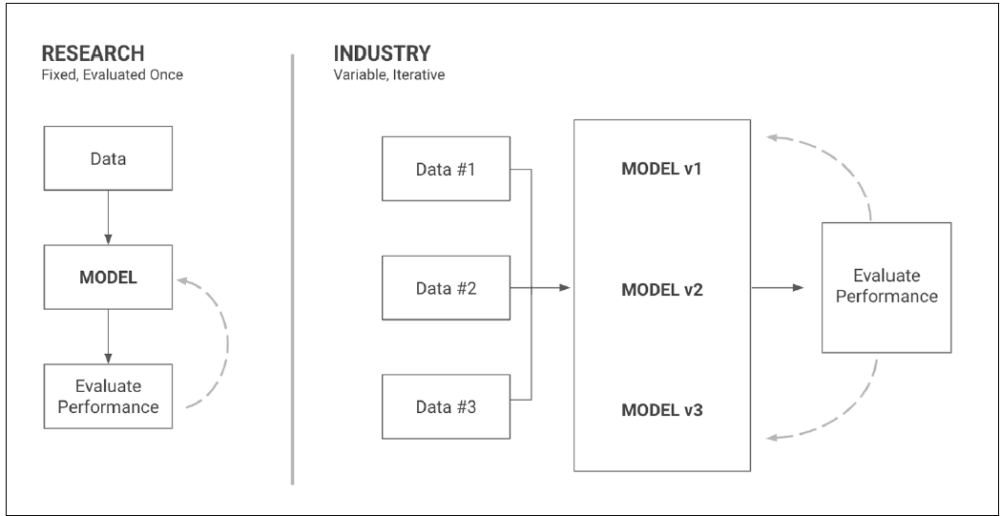

# Acquire an initial Dataset

## Iterate on Datasets
We need so see data only as a tool, that we can improve as well

Different workflows for researchers and industry

## Do Data Science

ML models are no magic trick, they can extract trends and pattern from data like a human being.