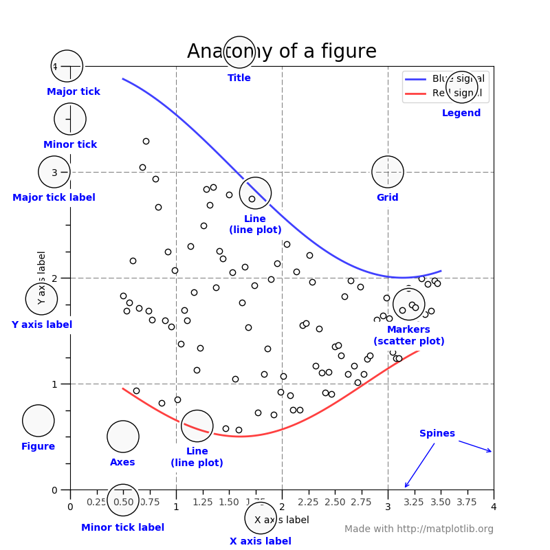

# Matplotlib
In matplotlib every plot is in a container or grid, these are called **figures**. Plots in figures are stored in **axis**,
these can be customized, changed in size and in location in the figure. **Ticks** are the steps on the x-axis/ y-axis, the
x-axis/y-axis is called **spine**, to differentiate better.

This library follows a simple workflow:
 1. create the Figure (only need if you show multiple plots, or you need more flexibility)
    ```
    fig, ax = plt.subplots()
    ```

 2. create a specific type of plot with values for the x and y:
    ```
    ax.scatter(x=x_values, y=y_values)
    ```
 3. Change the styling (Here, scale of x-axis was changed):
    ```
    ax.xscale('log')
    ```
 4. Print the plot:
    ```
    fig.show()
    ```
 5. Clear plot for next graphic:
    ```
    # clear axis
    fig.cla()
    # clear figure
    fig.clf()
    ``` 
     
#### Short version of plotting
```
df.plot(kind="scatter", x=x_values, y=y_values)
plt.show()

# Or create a figure with plot

```

## Different plots and elements in matplotlib


## Most important customizations
First let's have a deeper look into the anatomy of a figure:
